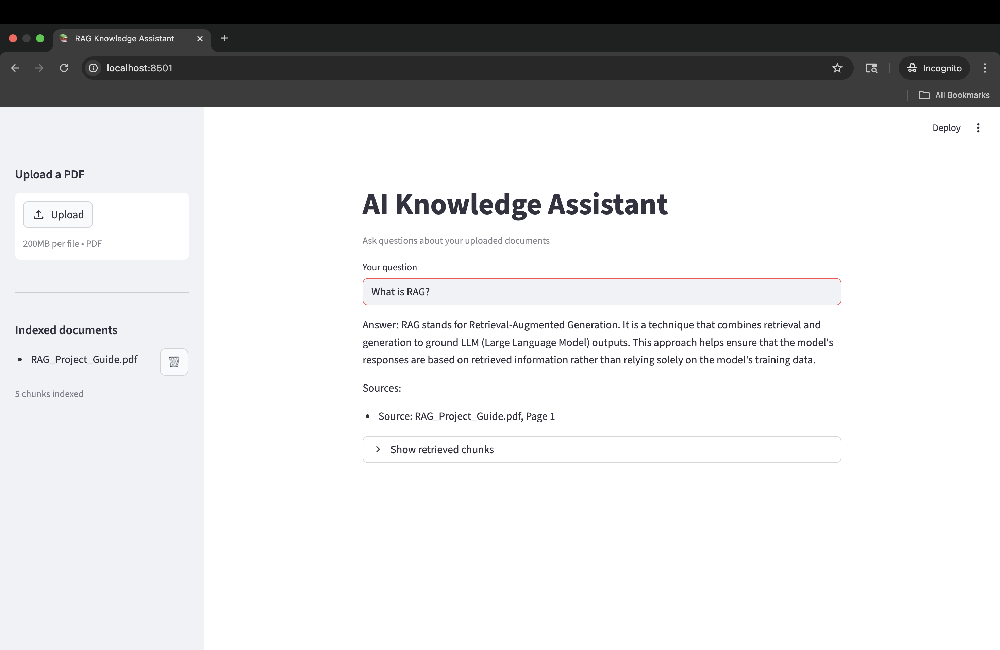

# Agentic RAG System with Claude and ChromaDB

[中文版本](#基于-claude-与-chromadb-的智能体式-rag-系统)

An end-to-end AI-powered document search and question-answering system built with Retrieval-Augmented Generation (RAG). Upload PDFs, ask questions, and get grounded answers with citations — powered by Anthropic's Claude and exposed as an OpenClaw agent skill.

---

## Demo


---

## How it works

1. **Ingest** — PDFs are loaded, split into chunks, and embedded using `sentence-transformers`
2. **Store** — Embeddings are persisted in a ChromaDB vector store
3. **Retrieve** — On each query, the top-k most relevant chunks are fetched
4. **Generate** — Claude receives the retrieved context and produces a citation-backed answer
5. **Serve** — Accessible via a Streamlit UI or as a callable OpenClaw skill

---

## Project structure

```
ai-rag-openclaw/
├── app/
│   ├── data/               # PDF documents (default: RAG_Project_Guide.pdf)
│   ├── ingest.py           # PDF loading and chunking
│   ├── retriever.py        # Vector search against ChromaDB
│   ├── generator.py        # Claude API call with retrieved context
│   ├── rag_pipeline.py     # Connects retrieval and generation
│   ├── streamlit_app.py    # Streamlit frontend
│   └── openclaw_skill.py   # Wraps RAG as a callable OpenClaw skill
├── assets/
│   └── demo.png            # Demo screenshot
├── .env                    # API keys (not committed)
├── .gitignore
├── requirements.txt
└── README.md
```

---

## Setup

### 1. Clone the repo

```bash
git clone https://github.com/MartinW-CS/ai-rag-openclaw.git
cd ai-rag-openclaw
```

### 2. Install dependencies

```bash
pip install -r requirements.txt
```

### 3. Set your API key

Create a `.env` file in the project root:

```
ANTHROPIC_API_KEY=your-api-key-here
```

---

## Usage

### Streamlit UI

```bash
streamlit run app/streamlit_app.py
```

Once the Streamlit web interface is launched, you can directly upload local PDF files and engage in Q&A regarding the document's content.

### OpenClaw skill

The `openclaw_skill.py` module exposes a `run(input)` entrypoint:

```python
from app.openclaw_skill import run

result = run({"query": "What is RAG?", "doc_path": "data/my_document.pdf"})
print(result["answer"])
# Sources: result["sources"]
```

Or test it directly from the terminal:

```bash
python app/openclaw_skill.py "What is RAG?"
```

---

## Answer format

All answers follow the citation format defined in the system prompt:

```
Answer:
<grounded response based on retrieved context>

Sources:
- <filename>, Page <n>
- <filename>, Page <n>
```

If the retrieved context is insufficient, the assistant explicitly states that the answer cannot be determined.

---

## Tech stack

| Component | Library |
|---|---|
| LLM | [Anthropic Claude](https://www.anthropic.com) |
| Vector store | [ChromaDB](https://www.trychroma.com) |
| Embeddings | [sentence-transformers](https://www.sbert.net) |
| PDF parsing | pypdf |
| Frontend | [Streamlit](https://streamlit.io) |
| Agent layer | OpenClaw |

---

## Evaluation

The system is designed to be evaluated across:

- **Chunk size** — smaller chunks improve precision, larger chunks preserve context
- **Top-k retrieval** — controls how much context is passed to Claude
- **Prompt design** — system prompt tuning to reduce hallucination and improve citation accuracy

---

## License

MIT

---

# 基于 Claude 与 ChromaDB 的智能体式 RAG 系统

一个端到端的 AI 文档检索与问答系统，基于检索增强生成（RAG）技术构建。支持上传 PDF、进行自然语言问答，并返回带引用来源的答案；系统由 Anthropic Claude 驱动，并集成 Agent Tool Calling 能力。

---

## 演示


---

## 工作原理

1. **文档摄入** — 加载 PDF，切分为文本块，并使用 `sentence-transformers` 生成向量嵌入
2. **向量存储** — 将嵌入持久化存储至 ChromaDB 向量数据库
3. **检索** — 每次提问时，从向量库中检索最相关的 top-k 文本块
4. **生成** — Claude 接收检索到的上下文，生成带引用的答案
5. **服务** — 可通过 Streamlit 界面访问，或作为 OpenClaw 技能调用

---

## 项目结构

```
ai-rag-openclaw/
├── app/
│   ├── data/               # PDF 文档（默认：RAG_Project_Guide.pdf）
│   ├── ingest.py           # PDF 加载与文本分块
│   ├── retriever.py        # 基于 ChromaDB 的向量检索
│   ├── generator.py        # 调用 Claude API 生成答案
│   ├── rag_pipeline.py     # 连接检索与生成的主管道
│   ├── streamlit_app.py    # Streamlit 前端界面
│   └── openclaw_skill.py   # 将 RAG 封装为可调用的 OpenClaw 技能
├── assets/
│   └── demo.png            # 演示截图
├── .env                    # API 密钥（不提交至 Git）
├── .gitignore
├── requirements.txt
└── README.md
```

---

## 环境配置

### 1. 克隆仓库

```bash
git clone https://github.com/MartinW-CS/ai-rag-openclaw.git
cd ai-rag-openclaw
```

### 2. 安装依赖

```bash
pip install -r requirements.txt
```

### 3. 配置 API 密钥

在项目根目录创建 `.env` 文件：

```
ANTHROPIC_API_KEY=your-api-key-here
```

---

## 使用方式

### Streamlit 界面

```bash
streamlit run app/streamlit_app.py
```

启动 Streamlit Web 界面后，可直接上传本地 PDF，并针对文档内容进行问答。

### OpenClaw 技能调用

`openclaw_skill.py` 模块暴露了一个 `run(input)` 入口函数：

```python
from app.openclaw_skill import run

result = run({"query": "什么是 RAG？", "doc_path": "data/my_document.pdf"})
print(result["answer"])
# 引用来源: result["sources"]
```

也可直接通过终端测试：

```bash
python app/openclaw_skill.py "什么是 RAG？"
```

---

## 答案格式

所有答案遵循系统提示词中定义的引用格式：

```
Answer:
<基于检索上下文的回答>

Sources:
- <文件名>, Page <页码>
- <文件名>, Page <页码>
```

若检索到的上下文信息不足，助手将明确说明无法确定答案。

---

## 技术栈

| 组件 | 库 |
|---|---|
| 大语言模型 | [Anthropic Claude](https://www.anthropic.com) |
| 向量数据库 | [ChromaDB](https://www.trychroma.com) |
| 文本嵌入 | [sentence-transformers](https://www.sbert.net) |
| PDF 解析 | pypdf |
| 前端界面 | [Streamlit](https://streamlit.io) |
| 智能体层 | OpenClaw |

---

## 评估维度

系统围绕以下三个维度进行评估与调优：

- **文本块大小** — 较小的块提高精确度，较大的块保留更多上下文
- **Top-k 检索数量** — 控制传递给 Claude 的上下文数量
- **提示词设计** — 优化系统提示词以降低幻觉率并提升引用准确性

---

## 许可证

MIT