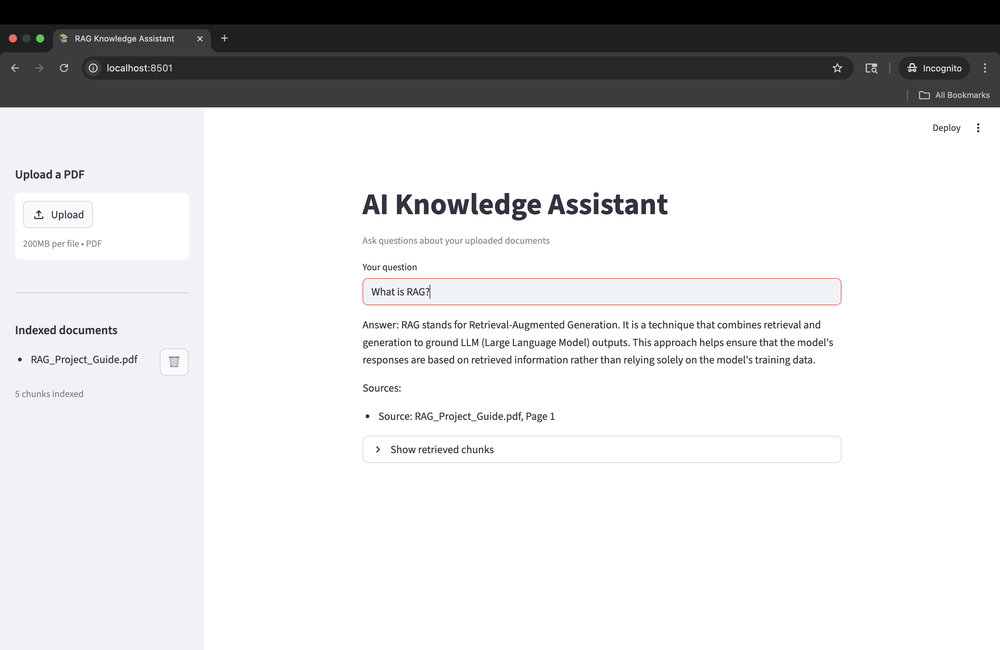

# Agentic RAG System with Claude and ChromaDB

[中文版本](#基于-claude-与-chromadb-的智能体式-rag-系统)

An end-to-end AI-powered document search and question-answering system built with Retrieval-Augmented Generation (RAG). Upload PDFs, ask questions, and get grounded answers with citations — powered by Anthropic's Claude and exposed as an OpenClaw agent skill.

---

## Demo


---

## How it works

1. **Ingest** — PDFs are loaded, split into chunks, and embedded using `sentence-transformers`
2. **Store** — Embeddings are persisted in a ChromaDB vector store
3. **Retrieve** — On each query, the top-k most relevant chunks are fetched
4. **Generate** — Claude receives the retrieved context and produces a citation-backed answer
5. **Serve** — Accessible via a Streamlit UI or as a callable OpenClaw skill

---

## Project structure

```
ai-rag-openclaw/
├── app/
│   ├── data/               # PDF documents (default: RAG_Project_Guide.pdf)
│   ├── ingest.py           # PDF loading and chunking
│   ├── retriever.py        # Vector search against ChromaDB
│   ├── generator.py        # Claude API call with retrieved context
│   ├── rag_pipeline.py     # Connects retrieval and generation
│   ├── streamlit_app.py    # Streamlit frontend
│   └── openclaw_skill.py   # Wraps RAG as a callable OpenClaw skill
├── assets/
│   └── demo.png            # Demo screenshot
├── .env                    # API keys (not committed)
├── .gitignore
├── requirements.txt
└── README.md
```

---

## Setup

### 1. Clone the repo

```bash
git clone https://github.com/MartinW-CS/ai-rag-openclaw.git
cd ai-rag-openclaw
```

### 2. Install dependencies

```bash
pip install -r requirements.txt
```

### 3. Set your API key

Create a `.env` file in the project root:

```
ANTHROPIC_API_KEY=your-api-key-here
```

---

## Usage

### Streamlit UI

```bash
streamlit run app/streamlit_app.py
```

Once the Streamlit web interface is launched, you can directly upload local PDF files and engage in Q&A regarding the document's content.

### OpenClaw skill

The `openclaw_skill.py` module exposes a `run(input)` entrypoint:

```python
from app.openclaw_skill import run

result = run({"query": "What is RAG?", "doc_path": "data/my_document.pdf"})
print(result["answer"])
# Sources: result["sources"]
```

Or test it directly from the terminal:

```bash
python app/openclaw_skill.py "What is RAG?"
```

---

## Answer format

All answers follow the citation format defined in the system prompt:

```
Answer:
<grounded response based on retrieved context>

Sources:
- <filename>, Page <n>
- <filename>, Page <n>
```

If the retrieved context is insufficient, the assistant explicitly states that the answer cannot be determined.

---

## Tech stack

| Component | Library |
|---|---|
| LLM | [Anthropic Claude](https://www.anthropic.com) |
| Vector store | [ChromaDB](https://www.trychroma.com) |
| Embeddings | [sentence-transformers](https://www.sbert.net) |
| PDF parsing | pypdf |
| Frontend | [Streamlit](https://streamlit.io) |
| Agent layer | OpenClaw |

---

## Evaluation

The system is designed to be evaluated across:

- **Chunk size** — smaller chunks improve precision, larger chunks preserve context
- **Top-k retrieval** — controls how much context is passed to Claude
- **Prompt design** — system prompt tuning to reduce hallucination and improve citation accuracy

---

## License

MIT

---

# 基于 Claude 与 ChromaDB 的智能体式 RAG 系统

一个端到端的 AI 文档检索与问答系统，基于检索增强生成（RAG）技术构建。支持上传 PDF、进行自然语言问答，并返回带引用来源的答案；系统由 Anthropic Claude 驱动，并集成 Agent Tool Calling 能力。

---

## 演示


---

## 工作原理

1. **文档摄入** — 加载 PDF，切分为文本块，并使用 `sentence-transformers` 生成向量嵌入
2. **向量存储** — 将嵌入持久化存储至 ChromaDB 向量数据库
3. **检索** — 每次提问时，从向量库中检索最相关的 top-k 文本块
4. **生成** — Claude 接收检索到的上下文，生成带引用的答案
5. **服务** — 可通过 Streamlit 界面访问，或作为 OpenClaw 技能调用

---

## 项目结构

```
ai-rag-openclaw/
├── app/
│   ├── data/               # PDF 文档（默认：RAG_Project_Guide.pdf）
│   ├── ingest.py           # PDF 加载与文本分块
│   ├── retriever.py        # 基于 ChromaDB 的向量检索
│   ├── generator.py        # 调用 Claude API 生成答案
│   ├── rag_pipeline.py     # 连接检索与生成的主管道
│   ├── streamlit_app.py    # Streamlit 前端界面
│   └── openclaw_skill.py   # 将 RAG 封装为可调用的 OpenClaw 技能
├── assets/
│   └── demo.png            # 演示截图
├── .env                    # API 密钥（不提交至 Git）
├── .gitignore
├── requirements.txt
└── README.md
```

---

## 环境配置

### 1. 克隆仓库

```bash
git clone https://github.com/MartinW-CS/ai-rag-openclaw.git
cd ai-rag-openclaw
```

### 2. 安装依赖

```bash
pip install -r requirements.txt
```

### 3. 配置 API 密钥

在项目根目录创建 `.env` 文件：

```
ANTHROPIC_API_KEY=your-api-key-here
```

---

## 使用方式

### Streamlit 界面

```bash
streamlit run app/streamlit_app.py
```

启动 Streamlit Web 界面后，可直接上传本地 PDF，并针对文档内容进行问答。

### OpenClaw 技能调用

`openclaw_skill.py` 模块暴露了一个 `run(input)` 入口函数：

```python
from app.openclaw_skill import run

result = run({"query": "什么是 RAG？", "doc_path": "data/my_document.pdf"})
print(result["answer"])
# 引用来源: result["sources"]
```

也可直接通过终端测试：

```bash
python app/openclaw_skill.py "什么是 RAG？"
```

---

## 答案格式

所有答案遵循系统提示词中定义的引用格式：

```
Answer:
<基于检索上下文的回答>

Sources:
- <文件名>, Page <页码>
- <文件名>, Page <页码>
```

若检索到的上下文信息不足，助手将明确说明无法确定答案。

---

## 技术栈

| 组件 | 库 |
|---|---|
| 大语言模型 | [Anthropic Claude](https://www.anthropic.com) |
| 向量数据库 | [ChromaDB](https://www.trychroma.com) |
| 文本嵌入 | [sentence-transformers](https://www.sbert.net) |
| PDF 解析 | pypdf |
| 前端界面 | [Streamlit](https://streamlit.io) |
| 智能体层 | OpenClaw |

---

## 评估维度

系统围绕以下三个维度进行评估与调优：

- **文本块大小** — 较小的块提高精确度，较大的块保留更多上下文
- **Top-k 检索数量** — 控制传递给 Claude 的上下文数量
- **提示词设计** — 优化系统提示词以降低幻觉率并提升引用准确性

---

## 许可证

MIT
## FastAPI API / HTTP 接口

From the repository root / 在仓库根目录运行：

```bash
python -m pip install -r requirements.txt
python -m uvicorn app.api:app --reload
```

Configure `ANTHROPIC_API_KEY` in the root `.env` and place PDFs in `app/data/`.
A background worker builds the in-memory index on startup and after document changes.
The initial build may download the embedding model. Questions use the last ready
version; before any version is ready they return 503 with Retry-After.
Run exactly one API worker per document directory. Streamlit remains available.

在根目录 `.env` 配置 `ANTHROPIC_API_KEY`，将 PDF 放入 `app/data/`。
服务启动和文档变化后自动在后台建立索引，首次运行可能下载嵌入模型。
索引未就绪时问答返回 503；更新期间可以查询已有版本。

```bash
curl http://127.0.0.1:8000/health
# {"status":"ok"}

curl -X POST http://127.0.0.1:8000/ask \
  -H 'Content-Type: application/json' \
  -d '{"question":"What is RAG?"}'
# {"answer":"...", "sources":[{"source":"example.pdf", "page":1}]}
```

`/health` reports process liveness only, without checking Claude or the index.
`/ask` returns the existing Claude answer plus deduplicated retrieved source/page
pairs (retrieval provenance, not a guarantee every page was cited in the answer).
Missing/blank questions return 422; missing credentials or a ready index
return 503; unexpected processing failures return 500 without exposing
internal exception details. Interactive API docs: http://127.0.0.1:8000/docs.

接口测试无需密钥、模型下载或 Claude 调用 / API contract tests use mocked RAG dependencies:

```bash
python -m pip install httpx
python -m unittest discover -s tests -v
```

## Next.js frontend / 新版问答界面

The `frontend/` app follows `DESIGN.md` and connects to the FastAPI endpoints
through server-side routes. Start FastAPI as above, then in a second terminal:

```bash
cd frontend
npm ci
npm run dev
```

Open http://localhost:3000. Optionally copy `frontend/.env.example` to
`frontend/.env.local` and change `RAG_API_URL` if the Python server runs elsewhere.
Keep `ANTHROPIC_API_KEY` in the repository root `.env`, never in browser variables.
The frontend proxies requests, so no CORS configuration is needed.

新版界面支持问题输入、生成状态、Markdown 答案、来源页码和错误重试。
连接状态仅表示后端存活，不表示密钥或索引已就绪。后台初始化可能需要下载模型。
新版侧栏支持 PDF 上传、完整文档列表和移除，文档变更后在后台重建索引。
上传后显示“排队中 → 索引中 → 已就绪 / 处理失败”，失败时可重试；上传不会调用 Claude。
Streamlit 入口继续保留。检索片段检查器、PDF 原文预览和来源页码跳转已接入。

Frontend validation / 前端检查：

```bash
cd frontend
npm run build
npm run typecheck
```


### Document management / 文档管理

- `GET /documents`: list PDF filenames, byte sizes, and `queued` / `indexing` / `indexed` / `failed` state.
- `POST /documents`: multipart form with a `file` field; returns 201.
- `DELETE /documents?filename=guide.pdf`: remove from the active library.

Uploads are limited to 10 MiB and must be valid PDFs with extractable text.
Encrypted PDFs and image-only scans return 422; duplicate filenames return 409
without overwriting the original. Uppercase `.PDF` extensions are normalized.
Removed files are retained under `app/data/.trash/<id>/` and excluded from retrieval.
To restore a removed file, move it back to `app/data/` without replacing an existing file.
Document management does not require an Anthropic key; questions still do.
Run one API worker. A process ownership lock rejects a second worker using the same directory.
If a retrieved source is removed or replaced during generation, the API discards the answer
and returns 409, asking the user to submit again.

```bash
curl http://127.0.0.1:8000/documents
curl -X POST http://127.0.0.1:8000/documents -F 'file=@/path/to/guide.pdf'
curl -X DELETE 'http://127.0.0.1:8000/documents?filename=guide.pdf'
```

The API and frontend are local development services without authentication.
Keep them bound to localhost; shared hosting requires access control.
Newly uploaded PDFs and the local recovery directory are excluded from Git.


## Bounded concurrency and background indexing

Requires **Python 3.11+ on Linux/macOS** (`asyncio.timeout` and POSIX file locks).
This is a single-process concurrency improvement, not a distributed deployment.

```bash
# Defaults shown; keep --workers 1. Never use --reload for load tests.
RAG_MAX_ASK=8 RAG_MAX_UPLOAD=2 RAG_RETRIEVAL_WORKERS=2 \
  python -m uvicorn app.api:app --host 127.0.0.1 --port 8000 --workers 1
```

- API admission allows at most 8 question requests and 2 PDF uploads at a time.
  Excess requests fail immediately with **429 + Retry-After**; no unbounded waiting queue.
- At most 2 retrieval jobs run in a dedicated executor. A timed-out caller does not
  release its CPU slot until the actual retrieval ends. Query embedding is serialized
  on its model instance. Background embedding uses a separate reusable model instance.
- Questions have a 60-second total application deadline; the reusable async Claude
  client has a 55-second request timeout and **zero automatic retries** to avoid
  retry amplification. Model errors map to 429 / 502 / 504. Next.js waits at most
  75 seconds and forwards Retry-After. It has its own fixed 8-question / 2-upload
  per-process admission limits; raising API limits alone does not raise these limits.
- Request bodies are capped **before parsing** in both Next.js and FastAPI:
  32 KiB for questions, 11 MiB for multipart uploads (file limit remains 10 MiB).
  Receiving a body has a 30-second deadline. Questions are limited to 8,000 characters.
- There is **one background build and one coalesced pending document state**.
  Changes during a build cause the obsolete candidate to be discarded, then the latest
  state is built. No separate rebuild job is queued for every upload.
- Each candidate uses a unique Chroma collection and a temporary PDF snapshot.
  A completed version is published only if the document signature still matches.
  Existing readers keep the prior version alive; retired collections are cleaned up
  after the final reader finishes. Failed builds retain the last ready version.
- Removed or replaced sources are filtered before generation and checked again before
  returning an answer. A model call already sent before deletion cannot be recalled;
  its answer is discarded if the relevant document changed.
- Failed builds do not retry in a tight loop. Use **POST /index/retry** or the UI retry
  button. External PDF changes are checked every 2 seconds. Document states are polled
  by the frontend while processing is in progress.
- Shutdown waits for active retrieval and background work before releasing ownership.
  CPU/native-library calls cannot be force-cancelled by an HTTP timeout. An external
  supervisor is still needed for a wedged process. All state is rebuilt after restart.

Tests use real PDF parsing, deterministic fake indexes/generation, and synchronization
barriers to verify overload rejection, health responsiveness, timeout cleanup, deletion
races, update coalescing, failure recovery, and safe index retirement. Optional Chroma
integration tests use the real vector store with small fake embeddings (no model download).
These are correctness checks, **not measured production capacity or real Claude benchmarks**.

Before multi-instance deployment, move document metadata and files to shared durable
storage, replace the in-process index worker with a durable task queue, and use a shared
vector database with coordinated versions. Authentication and per-user quotas are also
required for a shared service; this version remains localhost-only.


## Retrieval Inspector / 检索片段检查器

Each successful `/ask` response adds a `retrieval` object while retaining `answer`
and `sources`. Its `chunks` are exactly the ordered, source-filtered context chunks
passed to Claude, including full `text`, `source`, `page`, one-based `rank`,
`chunk_id`, `index_id`, `distance`, and `similarity_score`. Chunk IDs are scoped to
an index version; they are not permanent document identifiers. The source cards
remain deduplicated by file/page, while the inspector shows every context chunk.

Ranking is unchanged: API collections explicitly use **squared L2 distance**, with
smaller values first (`distance_metric: "squared_l2"`). The additional score is
**cosine similarity**, calculated directly from the query and returned chunk
embeddings (`similarity_metric: "cosine"`), ranging from -1 to 1. It is not `1 - L2`
and is not confidence, correctness, or a percentage. Zero-length vectors yield
`null`, displayed as “不可用”. Vectors themselves are not included in the HTTP response.

The UI shows filename, page, rank, both scores, and a two-line text preview.
Click or use the keyboard to expand each chunk and read its full text. Text is
rendered literally, not interpreted as HTML/Markdown. The panel describes the
context supplied to the model, not a claim that every chunk supports every sentence.
Older API responses without `retrieval` show an explicit unavailable message.

Top-K remains 4. Retrieval controls and chat history remain later Phase 4 steps.
Real Claude generation still needs an end-to-end validation using a configured
`ANTHROPIC_API_KEY` before final demo packaging; mocked generation in tests is not
that validation.

## Source Navigation + PDF Preview / 原文页预览

Click a source card or an Inspector chunk's filename/page to open that PDF at the
referenced page. Clicking a document in the sidebar opens page 1. The preview is
closed by default, appears on the right on desktop, and fills the screen on mobile.
It supports previous/next page, direct page entry, keyboard activation, Escape to
close, and focus return to the originating button. Mobile keyboard focus stays
inside the preview while it is open.

`GET /documents/{filename}/file` streams the current PDF through the same-origin
Next.js proxy `/api/documents/{filename}/file`. The backend reuses filename/path
validation, rejects symlinks and non-regular files, checks the PDF header and 10 MiB
limit, and opens with `O_NOFOLLOW` to prevent symlink replacement between validation
and reading. The open file descriptor pins an in-flight response across API deletion
or replacement. Responses use `application/pdf`, inline disposition, `nosniff`, and
`no-store`; missing or removed documents return 404. This endpoint uses the existing
single-process deployment model and does not add authentication.

The viewer uses react-pdf/PDF.js with locally served worker, CMaps, fonts, and WASM.
`npm run dev` and `npm run build` copy the matching installed assets into the ignored
`frontend/public/pdfjs/` directory automatically. There is no runtime CDN dependency.
This version downloads the full PDF (up to 10 MiB); byte-range loading is not added.
PDF annotation links/forms are disabled. Loading, missing-file, parse, encryption,
and rendering failures show an explicit message.

Preview displays the **current file**, not an immutable historical document version.
An out-of-range citation page shows a warning and the nearest valid page. Uploading
or removing a document in this UI closes the preview and clears the previous answer.

Validation:

```bash
.venv/bin/python -m unittest discover -s tests -v
npm --prefix frontend run build
```

Backend coverage includes returned PDF bytes/headers, Unicode filenames, deletion,
path traversal, symlinks (including replacement after validation), and size/header
checks. Browser smoke checks use the real three-page project PDF and real retrieval
with a clearly labeled generator test double: sidebar → page 1, keyboard source card
→ page 3, Inspector → page 2, manual jump, Escape/focus return, and a 390px mobile
preview. These checks do **not** count as real Claude E2E.
