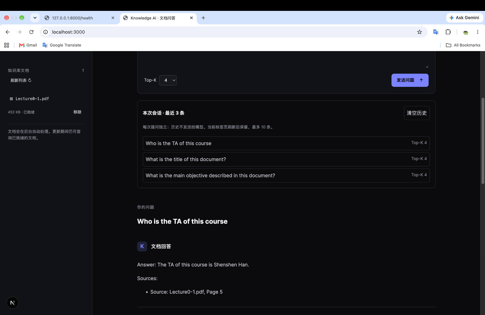
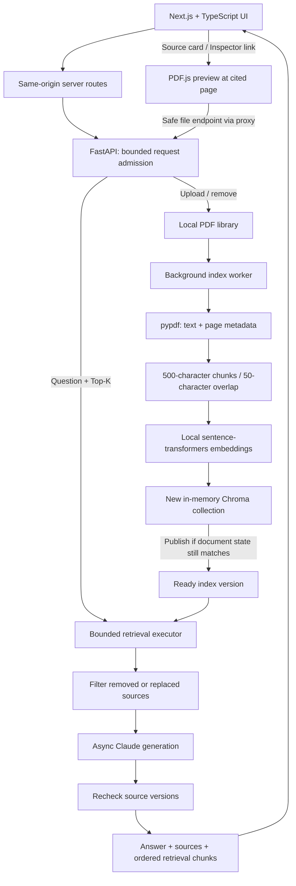

# Knowledge AI — Full-Stack Agentic RAG System

Ask grounded questions over PDFs, inspect the evidence sent to Claude, and open the source page behind an answer.

Knowledge AI combines PDF ingestion, local embeddings, ChromaDB retrieval, Claude generation, and page-level source navigation in a **FastAPI + Next.js / TypeScript** application. A separate Claude tool-use agent can search the document library through the OpenClaw entrypoint.

Built with production-style engineering practices—bounded concurrency, background indexing, and document race protection—within a **local, single-worker application**.

[Demo](#demo) · [Architecture](#architecture) · [Quick start](#quick-start) · [API](#api) · [Testing](#testing) · [中文概览](#中文概览)

## Demo



*Screenshot from the maintainer's manual Claude E2E session on October 5, 2026.*

| Step | Observed result |
| --- | --- |
| Question | “Who is the TA of this course?” |
| Retrieved evidence | `Lecture0-1.pdf`, page 5: “Teaching Staff … TAs: Shenshen Han” |
| Inspector | Page 5 ranked #1 with Top-K 4; cosine similarity 0.459, squared L2 distance 1.0825 |
| Answer | “The TA of this course is Shenshen Han.” |
| Citation | `Lecture0-1.pdf`, page 5 |

The demo follows the evidence chain: **question → retrieved chunks → Claude answer → source card → PDF page**. The course PDF is not bundled; use your own text-based PDF or the included `app/data/RAG_Project_Guide.pdf` to reproduce the workflow.

## Highlights

- **Inspect the actual context.** Retrieval Inspector shows ordered chunks, full text, file/page, rank, squared L2 distance, and cosine similarity for the context passed to Claude.
- **Navigate to the evidence.** Source cards and Inspector links open the corresponding PDF page. The preview supports direct page entry, keyboard navigation, Escape to close, focus restoration, and mobile fullscreen mode.
- **Compare retrieval scope.** Choose Top-K **2 / 4 / 6 / 8**, default **4**. Each result retains its requested limit and actual chunk count.
- **Revisit successful questions.** Keep the latest **10** answer snapshots in the current tab's `sessionStorage`, including sources and retrieval details. History survives refresh; each question remains independent.
- **Manage PDFs without blocking questions.** Upload, list, remove, track indexing status, and retry failed builds. Existing ready documents remain queryable during updates.
- **Handle concurrent work explicitly.** Admission limits, deadlines, bounded retrieval execution, versioned index publication, and deletion checks protect the request lifecycle.
- **Ground generation in retrieved text.** Prompts instruct Claude to cite sources and report insufficient context. These instructions are guardrails, not a guarantee of correctness.
- **Explore agent-driven retrieval separately.** The OpenClaw entrypoint exposes `search_documents` to a Claude tool-use loop; the web application uses a direct retrieval-and-generation path.

## Architecture


```mermaid
flowchart TD
    UI[Next.js + TypeScript UI] --> Proxy[Same-origin server routes]
    Proxy --> API[FastAPI: bounded request admission]
    API -->|Upload / remove| Files[Local PDF library]
    Files --> Worker[Background index worker]
    Worker --> Parse[pypdf: text + page metadata]
    Parse --> Split[500-character chunks / 50-character overlap]
    Split --> Embed[Local sentence-transformers embeddings]
    Embed --> Candidate[New in-memory Chroma collection]
    Candidate -->|Publish if document state still matches| Ready[Ready index version]
    API -->|Question + Top-K| Retrieve[Bounded retrieval executor]
    Ready --> Retrieve
    Retrieve --> Check[Filter removed or replaced sources]
    Check --> Claude[Async Claude generation]
    Claude --> Verify[Recheck source versions]
    Verify --> Evidence[Answer + sources + ordered retrieval chunks]
    Evidence --> UI
    UI -->|Source card / Inspector link| PDF[PDF.js preview at cited page]
    PDF -->|Safe file endpoint via proxy| API
```

The API indexes PDFs at startup and after document changes. Indexes are **in memory** and rebuilt on restart; the PDF files remain on disk. Query and background embedding use separate reusable model instances. A ready index remains available while a replacement is built.

The legacy Streamlit UI and the CLI agent use the original synchronous helpers; they do not inherit the API's request admission or background-index lifecycle.

### Stack

| Layer | Implementation |
| --- | --- |
| Web UI | Next.js, React, TypeScript, React Markdown |
| PDF preview | react-pdf / PDF.js with local worker, fonts, CMaps, and WASM |
| HTTP API | FastAPI, Pydantic, Uvicorn |
| PDF extraction | pypdf; page-aware character chunking |
| Embeddings | sentence-transformers, `all-MiniLM-L6-v2` |
| Vector retrieval | ChromaDB ephemeral collections; squared L2 ranking |
| Generation | Anthropic async client; model configured in `app/generator.py` |
| Agent entrypoint | Claude `search_documents` tool loop in `app/openclaw_skill.py` |
| Legacy UI | Streamlit |
| Visual system | [DESIGN.md](DESIGN.md) |

## Quick start

### 1. Install the backend

Use **Python 3.11+ on macOS or Linux** (the API uses POSIX file locks) and **Node.js 22.18+** for the frontend and native TypeScript history tests.

```bash
git clone https://github.com/MartinW-CS/ai-rag-openclaw.git
cd ai-rag-openclaw
python3 -m venv .venv
source .venv/bin/activate
python -m pip install -r requirements.txt
```

Create `.env` in the repository root:

```dotenv
ANTHROPIC_API_KEY=your-api-key-here
```

Use an Anthropic account with API access and billing configured. Keep this key server-side; do not put it in `NEXT_PUBLIC_*` variables or commit it. Generation sends the question and retrieved document chunks to Anthropic; embedding runs locally.

The checked-in model ID is `claude-sonnet-4-5-20250929` in `app/generator.py`; the CLI agent has its own constant in `app/openclaw_skill.py`. There is no model environment-variable override in this version. If your account cannot access the configured model, update the applicable constant to a model available to your account.

### 2. Start FastAPI

From the repository root, with the virtual environment active:

```bash
python -m uvicorn app.api:app --host 127.0.0.1 --port 8000 --workers 1
```

The first index build may download the embedding model. Wait for the document status to become ready before asking a question. Only **one API worker per document directory** is supported; an ownership lock rejects a second worker.

- Health: <http://127.0.0.1:8000/health>
- Interactive API docs: <http://127.0.0.1:8000/docs>

`/health` checks process liveness only. It does not validate Claude credentials or index readiness.

### 3. Start Next.js

In a second terminal:

```bash
cd ai-rag-openclaw/frontend  # adjust to your checkout location
npm ci
cp .env.example .env.local
npm run dev -- --hostname 127.0.0.1
```

Open <http://127.0.0.1:3000>. `frontend/.env.local` configures the server-side proxy:

```dotenv
RAG_API_URL=http://127.0.0.1:8000
```

The browser calls same-origin Next.js routes; the Anthropic key stays in Python. PDF.js resources are copied locally during `predev` and `prebuild`, with no runtime CDN dependency.

### 4. Try the evidence workflow

1. Upload a PDF containing selectable text, then wait for **已就绪** (ready).
2. Ask a specific question whose answer you can locate in the document.
3. Read the answer and expand the Inspector to compare the retrieved text.
4. Click a source card to open its PDF page.
5. Change Top-K, ask again, and compare results through session history.

For the bundled project guide, try: **“What are the core architecture steps described in the project guide?”**

## Retrieval and history semantics

**Top-K counts chunks, not PDFs or pages.** Larger values can improve coverage but also add unrelated context and token cost. The API accepts only integers `2`, `4`, `6`, and `8`; omitted `top_k` defaults to `4`. Available content or source filtering can yield fewer chunks than requested.

The Inspector reports two distinct measures:

| Measure | Meaning |
| --- | --- |
| Squared L2 distance | The API's ranking metric; smaller values rank first |
| Cosine similarity | Computed from query/chunk embeddings; range −1 to 1, larger means more similar |

Cosine similarity is not `1 - L2`, answer confidence, or a correctness percentage. Zero-length vectors yield `null`. Embedding vectors are not returned in the response.

`retrieval.chunks` contains the ordered context passed to Claude. Source cards deduplicate that context by file/page; they are retrieval provenance, not a parsed list of every citation in the generated text. Chunk IDs are scoped to an index version.

History saves successful question/answer snapshots, including their original Top-K, sources, and retrieval information. Restoring history makes no new model call. There is no conversation context, database, login, or cross-device synchronization. Storage failures fall back to memory with a visible notice; browser session recovery may restore tab storage.

PDF navigation opens the **current file**, not an archived version of the historical answer's document. Missing files show an error; out-of-range pages show a warning and the nearest valid page. Preview downloads the full PDF; byte-range loading and PDF annotation links/forms are not enabled.

## API

| Method | Endpoint | Purpose |
| --- | --- | --- |
| GET | `/health` | Process liveness |
| POST | `/ask` | Independent question with optional `top_k` |
| GET | `/documents` | Filename, byte size, indexing state |
| POST | `/documents` | Multipart upload, field `file` |
| DELETE | `/documents?filename=guide.pdf` | Remove from active library |
| GET | `/documents/{filename}/file` | Read a validated PDF for preview |
| POST | `/index/retry` | Retry a failed index build |

```bash
curl http://127.0.0.1:8000/health

curl -X POST http://127.0.0.1:8000/documents \
  -F 'file=@/path/to/guide.pdf'

curl -X POST http://127.0.0.1:8000/ask \
  -H 'Content-Type: application/json' \
  -d '{"question":"What are the key steps?","top_k":4}'
```

An `/ask` response includes `answer`, `sources`, and `retrieval` (`top_k`, `distance_metric`, `similarity_metric`, and `chunks`). Each chunk includes rank, text, source, page, chunk/index IDs, distance, and similarity score.

| Status | Typical cause |
| --- | --- |
| 409 | Duplicate upload or a retrieved document changed during generation |
| 413 | File or request body exceeds its limit |
| 422 | Invalid question/Top-K, encrypted PDF, or PDF without extractable text |
| 429 | Application capacity or upstream model rate limit; inspect `Retry-After` |
| 502 | Model service error |
| 503 | Missing API key or no usable ready index |
| 504 | Answer deadline or model timeout |

Questions are limited to 8,000 characters. Request bodies are capped before parsing: 32 KiB for questions and 11 MiB for multipart uploads, with a 30-second body-receive deadline. Unexpected processing errors return a generic 500 response.

## Engineering decisions

### Bounded concurrency

| Setting | Default | Role |
| --- | --- | --- |
| `RAG_MAX_ASK` | 8 | Admitted API question requests |
| `RAG_MAX_UPLOAD` | 2 | Admitted API uploads |
| `RAG_RETRIEVAL_WORKERS` | 2 | Dedicated retrieval executor capacity |

Excess work receives **429 + Retry-After** rather than joining an unbounded queue. Query embedding is serialized on its model instance. Timed-out CPU jobs retain their executor slot until the underlying work finishes.

Questions have a 60-second application deadline. The reusable async Claude client uses a 55-second timeout and zero automatic retries. Next.js uses a 75-second backend deadline and its own fixed per-process limits of 8 questions and 2 uploads; increasing Python limits alone does not increase those frontend limits.

These are resource bounds, not measured production throughput or distributed scaling claims.

### Background indexing and document races

- One background build and one coalesced pending document state prevent a rebuild queue per upload.
- Each candidate uses a temporary PDF snapshot and a unique Chroma collection. Publication requires the current document signature to still match.
- Existing readers hold the old version until they finish; retired collections are then removed. Failed builds retain the last ready version and allow explicit retry.
- Removed/replaced sources are filtered before generation and rechecked before responding. A relevant change during generation discards the answer with 409; an already-sent Claude request cannot be recalled.
- External file changes are checked every two seconds. The UI polls document status while indexing is in progress.
- Shutdown drains retrieval/background work. HTTP deadlines cannot force-cancel native CPU calls; a process supervisor is needed to recover a wedged process.

### PDF handling

Uploads must contain extractable text and fit within **10 MiB**. Duplicate filenames return 409 without overwriting; uppercase `.PDF` extensions are normalized. States are `queued`, `indexing`, `indexed`, and `failed`.

Removal moves a file into `app/data/.trash/<id>/`, outside active retrieval. To restore it, move it back into `app/data/` without replacing an existing file. Uploaded PDFs and recovery files are excluded from Git.

The preview endpoint validates filenames, rejects traversal/symlinks/non-regular files, checks the PDF header and size, and opens with `O_NOFOLLOW`. The open descriptor prevents a later path replacement from redirecting an in-flight response. Responses use `application/pdf`, inline disposition, `nosniff`, and `no-store`.

## Testing

From the repository root, with the Python environment active:

```bash
python -m pip install httpx
python -m unittest discover -s tests -v
node --test frontend/tests/session-history.test.mjs
npm --prefix frontend run build
npm --prefix frontend run typecheck
```

| Validation | Coverage |
| --- | --- |
| Backend suite | API contracts, Top-K validation/context size, real PDF parsing, upload validation, index lifecycle, overload, timeouts, deletion races, retry, safe PDF reads |
| Chroma integration | Real vector store with deterministic tiny embeddings; ranking, scores, filtering, collection isolation and cleanup |
| History tests | Latest 10 entries, snapshot serialization, malformed storage rejection |
| Frontend checks | Production build and TypeScript checking |
| Browser smoke checks | Top-K selection, history restore/clear/refresh, source/Inspector navigation, PDF paging, keyboard focus, mobile preview |

The latest feature validation recorded **30 backend tests and 2 history tests passing**, plus frontend build/type checks. Automated tests use test doubles for model generation and require neither a real Claude key nor a model download. Browser smoke checks previously used real embeddings/retrieval with a labeled generator test double.

### Manual real-Claude validation

The maintainer's October 5, 2026 session recorded real PDF upload, background indexing, embeddings/Chroma retrieval, and Claude generation. The answer screenshot above confirms the TA answer and page-5 citation; the accompanying Inspector screenshot showed page 5 at rank #1. The session also reported PDF source navigation and an insufficient-context response for a question whose answer was absent from the retrieved chunks.

This is a **manual smoke test**, not a repeatable accuracy benchmark or proof that hallucinations cannot occur. The course PDF and API credentials are not included. To repeat the gate with your own document:

1. Upload a real text PDF and wait for indexing.
2. Ask a question with an answer you can verify on a known page.
3. Confirm the answer, cited page, Inspector text, and PDF navigation agree.
4. Ask a question unsupported by the retrieved context and check that the response acknowledges insufficient information.

## Running a local production build

Keep the Python API command from Quick start running with one worker. For Next.js:

```bash
cd frontend
npm ci
npm run build
npm run start -- --hostname 127.0.0.1
```

This repository has **no authentication or tenant isolation**. Keep the services on localhost. Shared hosting requires access control, quotas, durable shared document storage, a durable job queue, and coordinated vector-index versions. Do not use `--reload` for concurrency measurements or multiple API workers against the same document directory.

Current limits include text-only extraction (no OCR), character-based chunking, in-memory indexes, and independent questions. Chunk size/overlap are code constants rather than online controls; reranking, hybrid retrieval, and multi-turn conversational RAG are not implemented.

## Legacy UI and agent entrypoints

From the repository root with the virtual environment active:

```bash
# Original Streamlit interface
streamlit run app/streamlit_app.py

# Interactive direct RAG CLI
python app/rag_pipeline.py

# Interactive agent with the search_documents tool
python app/openclaw_skill.py
```

The agent can refine its search through a bounded loop of up to five model turns. Its `run_agent(...)` function and CLI are the implemented entrypoints; there is no `run(input)` wrapper in this checkout. Web Top-K controls and session history apply to the Next.js/FastAPI path.

## Project map

```text
app/
  api.py                 HTTP contracts and document endpoints
  api_index.py           Version-specific vector retrieval and scores
  index_service.py       Background builds, leases, publication and retirement
  concurrency.py         Admission limits and bounded execution
  async_generator.py     Reusable async Claude client
  ingest.py              PDF extraction and page-aware chunking
  generator.py           Shared grounding prompt and model constant
  retriever.py           Original synchronous retrieval helpers
  rag_pipeline.py        Direct RAG CLI
  streamlit_app.py       Legacy UI
  openclaw_skill.py      Claude tool-use agent CLI
  data/                  Local PDFs and bundled project guide
frontend/
  app/                   UI, Inspector, PDF preview, same-origin API routes
  lib/                   Backend proxy, request limits, session history
  scripts/               Local PDF.js asset preparation
  tests/                 History tests
tests/                   Backend and Chroma integration tests
assets/                  Demo images
DESIGN.md                Visual and interaction guidelines
```

## 中文概览

Knowledge AI 是一个完整的 PDF 文档问答项目：上传文件后后台建立索引，使用本地 embedding 与 ChromaDB 检索，再交给 Claude 生成带来源的答案。Next.js 界面支持查看实际检索片段、跳转 PDF 对应页、调整 Top-K，以及回看当前标签页最近 10 条成功问答。

项目重点是让证据链可检查，同时处理并发限制、后台索引更新、文档删除竞态和安全原文读取。真实 Claude 手动联调已记录；自动化测试使用生成替身，两者在上文分别说明。当前定位为本地单进程应用，不包含登录、多用户隔离或多轮对话记忆。
